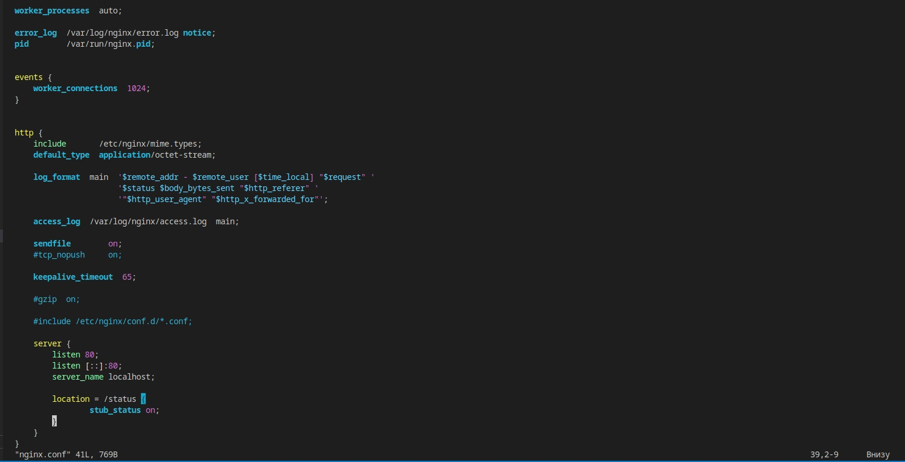

# Simple Docker

## Part 1. Готовый докер

+ ***Взять официальный докер образ с nginx и выкачать его при помощи docker pull***
  
  ***Сделали pull докер-образа с nginx***
  
  

+ ***Проверить наличие докер образа через docker images***
  
  ***Проверяем наличие докер образа***
  
  

+ ***Запустить докер образ через docker run -d [image_id|repository]***
  
  ***Запускаем докер командой docker run -d nginx***
  
  

+ ***Проверить, что образ запустился через docker ps***
  
  ***Проверка запуска***
  
  

+ ***Посмотреть информацию о контейнере через docker inspect [container_id|container_name]***
  
  ***Иформация контейнера***
  
  

+ ***По выводу команды определить и поместить в отчёт размер контейнера, список замапленных портов и ip контейнера***
  
  ***Размер контейнера***
  
  
  
  ***Список замапленных портов***
  
  
  
  ***IP контейнера***
  
  

+ ***Остановить докер образ через docker stop [container_id|container_name]***
  
  ***Остановка докер-образа***
  
  

+ ***Проверить, что образ остановился через docker ps***
  
  ***Проверка того, что образ остановился (ни один процесс не запущен)***
  
  

+ ***Запустить докер с портами 80 и 443 в контейнере, замапленными на такие же порты на локальной машине, через команду run***
  
  ***Тк контейнеры по-умолчанию запускаются с портом 80, то нужно изменить в его конфиге, на любой другой порт (я изменил на порт 90). После чего запускаем докер-образ.***

  

+ ***Проверить, что в браузере по адресу localhost:80 доступна стартовая страница nginx***
  
  ***Для начала проверим, что докер-образ запустился командой docker ps. Все ок, у нас он запущен. Далее проверим стартовую страницу nginx***

  
  
  

+ ***Перезапустить докер контейнер через docker restart [container_id|container_name]***
  
  ***Делаем рестарт докер-контейнера***
  
  

+ ***Проверить любым способом, что контейнер запустился***
  
  

## Part 2. Операции с контейнером

+ ***Прочитать конфигурационный файл nginx.conf внутри докер контейнера через команду exec***
  
  ***Читаем файл nginx.conf с помощью exec***
  
  

+ ***Создать на локальной машине файл nginx.conf***
  
  ***Создаем файл nginx.conf и прописываем в нем порт 80, также location = /status {stub_status on}; для того, чтобы появилась страница по адресу localhost/status с отображением статуса***
  
  

+ ***Скопировать созданный файл nginx.conf внутрь докер образа через команду docker cp. Перезапустить nginx внутри докер образа через команду exec***
  
  ***Скопировали nginx.conf по пути /etc/nginx/nginx.conf, после чего перезапустили докер-образ. Сигнал успешный***
  
  

+ ***Проверить, что по адресу localhost:80/status отдается страничка со статусом сервера nginx***
  
  ***Переходим по адресу localhost:80/status и видим, что все работает***
  
  

+ ***Экспортировать контейнер в файл container.tar через команду export***
  
  ***Прописываем соответственно экспорт для контейнера***
  
  

+ ***Остановить контейнер. Удалить образ через docker rmi [image_id|repository], не удаляя перед этим контейнеры***
  
  ***Остановили контейнер и удалили образ***
  
  

+ ***Удалить остановленный контейнер***
  
  

+ ***Импортировать контейнер обратно через команду import. Запустить импортированный контейнер.***
  
  ***Прописываем импорт контейнера, все ок, появился его хэш код. Запускаем импортированный контейнер в интерактивном режиме (-it), после чего, внутри контейнера, запускаем его***
  
  

+ ***Проверить, что по адресу localhost:80/status отдается страничка со статусом сервера nginx***
  
  ***Переходим по адресу localhost:80/status и видим, что страничка отдается вместе со статусом***
  
  

## Part 4. Свой докер

+ ***Написать свой докер образ, который:***
  
  ***1) собирает исходники мини сервера на FastCgi из Части 3***
  
  ***2) запускает его на 8080 порту***
  
  ***3) копирует внутрь образа написанный ./nginx/nginx.conf***
  
  ***4) запускает nginx.***

  

+ ***Собрать написанный докер образ через docker build при этом указав имя и тег***
  
  ***Cборка с именем test и тегом 1***
  
  

+ ***Проверить через docker images, что все собралось корректно***
  
  

+ ***Запустить собранный докер образ с маппингом 81 порта на 80 на локальной машине и маппингом папки ./nginx внутрь контейнера по адресу, где лежат конфигурационные файлы nginx'а (см. Часть 2)***
  
  

+ ***Проверить, что по localhost:80 доступна страничка написанного мини сервера***
  
  

+ ***Перезапустить докер образ***
  
  

+ ***Проверить, что теперь по localhost:80/status отдается страничка со статусом nginx***
  
  

## Part 5. Dockle

+ ***Просканировать образ из предыдущего задания через dockle [image_id|repository]***
  
  

+ ***Исправленный докерфайл***
  
  

+ ***Исправить образ так, чтобы при проверке через dockle не было ошибок и предупреждений***
  
  

## Part 6. Базовый Docker Compose

+ ***Написать файл docker-compose.yml, с помощью которого:***
  
  ***1) Поднять докер контейнер из Части 5 (он должен работать в локальной сети, т.е. не нужно использовать инструкцию EXPOSE и мапить порты на локальную машину)***
  
  ***2) Поднять докер контейнер с nginx, который будет проксировать все запросы с 8080 порта на 81 порт первого контейнера***

  ***Написали docker-compose.yaml***

  

  ***Прописываем docker-compose build***

  

+ ***Собрать и запустить проект с помощью команд docker-compose build и docker-compose up. Проверить, что в браузере по localhost:80 отдается написанная вами страничка, как и ранее.***
  
  

  